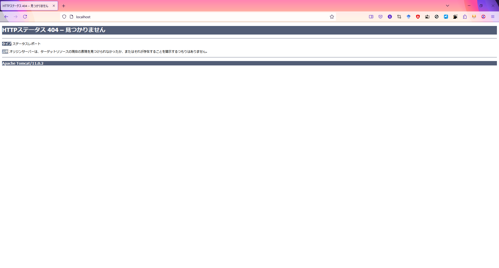

# 作業記録

## 本書の目的

本プロジェクトは、 Tomcatコンテナ + Java アプリ を用いて、最小のAPIコンテナを構成することを目的とする。

本書は、上記コンテナを構成する手順を記録する。

## VS Code のインストール

https://azure.microsoft.com/ja-jp/products/visual-studio-code

### プラグイン

Remote Development by Microsoft https://marketplace.visualstudio.com/items?itemName=ms-vscode-remote.vscode-remote-extensionpack
Github Copilot bu GitHub https://marketplace.visualstudio.com/items?itemName=GitHub.copilot

## WSLのインストール

コマンドプロンプトでWSLをインストールする。デフォルト、WSL Ubuntu がインストールされる。

```cmd
> wsl --install
> wsl -l -v
  NAME      STATE           VERSION
* Ubuntu    Running         2
```

VScodeからWSLにSSHでアタッチし、バージョンを確認。
今回は、 WSL 2 における、 Ubuntu24.04 だった。

```sh
$ lsb_release -a
No LSB modules are available.
Distributor ID: Ubuntu
Description:    Ubuntu 24.04.1 LTS
Release:        24.04
Codename:       noble
```

## Docker のインストール

Docker Engine を Ubuntu にインストール。 see. https://docs.docker.com/engine/install/ubuntu/

カレントユーザーを docker グループに登録、dockerの常時起動を設定。 https://docs.docker.com/engine/install/linux-postinstall/

## Tomcatコンテナのpullと内容確認

https://hub.docker.com/_/tomcat を見て考え...る前に、最小のDockerfileをVSCodeでさっくり作る。

```sh
$ mkdir build && cd $_
build$ touch Dockerfile
build$ cat Dockerfile
FROM tomcat:latest
```

compose.yaml を準備、とりあえず動かしてみる。

```sh
build$ touch compose.yaml
build$ cat compose.yaml
services:
  tomcat-java-api:
    image: tomcat-java-api:latest
    build:
      context: ..
      dockerfile: build/Dockerfile
build$ docker compose build
build$ docker compose up -d
```

で、入ってみたところ、それっぽくなったので、まずは成功。Dockerfileの最終行に与えたコマンドを特定しておく。

```sh
build$ docker exec -it build-tomcat-java-api-1 bash
root@db618196f52e:/usr/local/tomcat# ls
bin           conf             filtered-KEYS  LICENSE  native-jni-lib  README.md      RUNNING.txt  upstream-KEYS  webapps.dist
BUILDING.txt  CONTRIBUTING.md  lib            logs     NOTICE          RELEASE-NOTES  temp         webapps        work
root@db618196f52e:/usr/local/tomcat# exit
build$ docker inspect build-tomcat-java-api-1 | jq '.[].Config.Cmd'
[
  "catalina.sh",
  "run"
]
build$ cat Dockerfile
FROM tomcat:latest
CMD ["catalina.sh", "run"]
build$ docker compose build && docker compose up -d
```

で、Tomcatコンテナの使い方を全く知らないので調査。

```sh
build$ docker exec -it build-tomcat-java-api-1 bash
root@b3d36bcfb3c4:/usr/local/tomcat# which catalina.sh
/usr/local/tomcat/bin/catalina.sh
root@b3d36bcfb3c4:/usr/local/tomcat# catalina.sh help
Using CATALINA_BASE:   /usr/local/tomcat
Using CATALINA_HOME:   /usr/local/tomcat
Using CATALINA_TMPDIR: /usr/local/tomcat/temp
Using JRE_HOME:        /opt/java/openjdk
Using CLASSPATH:       /usr/local/tomcat/bin/bootstrap.jar:/usr/local/tomcat/bin/tomcat-juli.jar
Using CATALINA_OPTS:   
Usage: catalina.sh ( commands ... )
commands:
  debug             Start Catalina in a debugger
  jpda start        Start Catalina under JPDA debugger
  run               Start Catalina in the current window
  start             Start Catalina in a separate window
  stop              Stop Catalina, waiting up to 5 seconds for the process to end
  stop n            Stop Catalina, waiting up to n seconds for the process to end
  stop -force       Stop Catalina, wait up to 5 seconds and then use kill -KILL if still running
  stop n -force     Stop Catalina, wait up to n seconds and then use kill -KILL if still running
  configtest        Run a basic syntax check on server.xml - check exit code for result
  version           What version of tomcat are you running?
Note: Waiting for the process to end and use of the -force option require that $CATALINA_PID is defined
root@b3d36bcfb3c4:/usr/local/tomcat# find . | grep server.xml
./conf/server.xml
```

server.html のコメントに Documentation at /docs/config/server.html とか書いてあるので読みたい。
（推測）Tomcat にHTTPアクセスすれば読める？
（調査１）Tomcat にHTTPアクセスするにはどうしたら？ とりま catalina.sh のログでも読むか...

```sh
root@b3d36bcfb3c4:/usr/local/tomcat# exit
build$ docker logs build-tomcat-java-api-1
（略）
31-Jan-2025 14:35:51.798 INFO [main] org.apache.coyote.AbstractProtocol.init Initializing ProtocolHandler ["http-nio-8080"]
（略）
```

こよが、8080ポートで立ってるって言ってる気がする。

```sh
build$ docker exec -it build-tomcat-java-api-1 bash
root@b3d36bcfb3c4:/usr/local/tomcat# curl http://localhost:8080/
<!doctype html><html lang="en"><head><title>HTTP Status 404 – Not Found</title>（出力以下略）
root@b3d36bcfb3c4:/usr/local/tomcat# curl http://localhost:80/
curl: (7) Failed to connect to localhost port 80 after 0 ms: Couldn't connect to server
root@b3d36bcfb3c4:/usr/local/tomcat# exit
```

本当に立ってたので、DockerfileにExposeを、compose.yamlにportsを各々追加して再起動。

```sh
build$ cat Dockerfile
FROM tomcat:latest
Expose 8080
CMD ["catalina.sh", "run"]
build$ cat compose.yaml
services:
  tomcat-java-api:
    image: tomcat-java-api:latest
    build:
      context: ..
      dockerfile: build/Dockerfile
    ports:
      - target: 8080
        published: 80
        protocol: tcp
        mode: host
build$ docker compose build && docker compose up -d
```

上記の結果として、手元ブラウザの http://localhost/ からコンテナにアクセスできるようになった。



中身のコンテンツを何も設定できていないので４０４エラーになっているが、あたりまえ体操なので問題ない。
HTTPエラーが発生しているということは、ネットワークエラーが発生していない、すなわちHTTPサーバに正しくアクセスできているということである。
