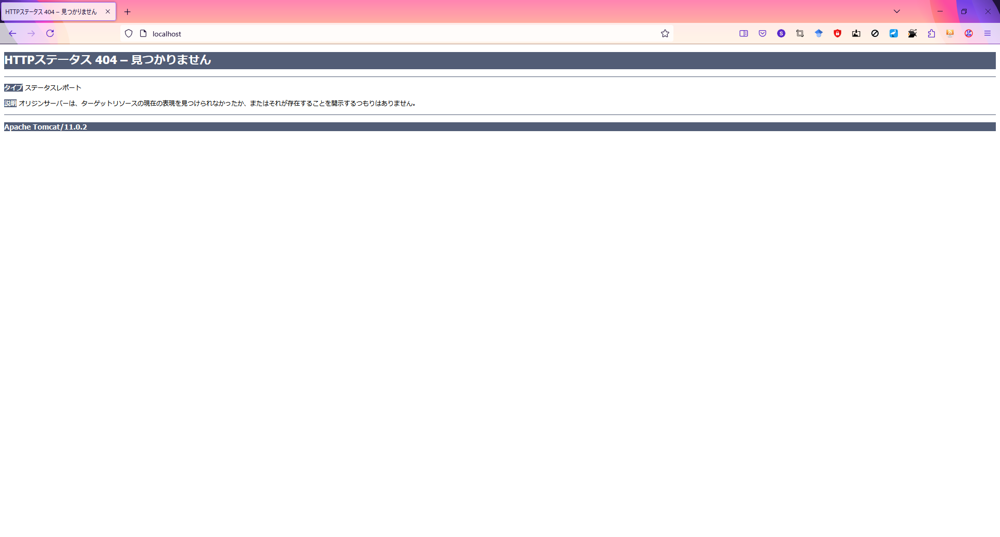
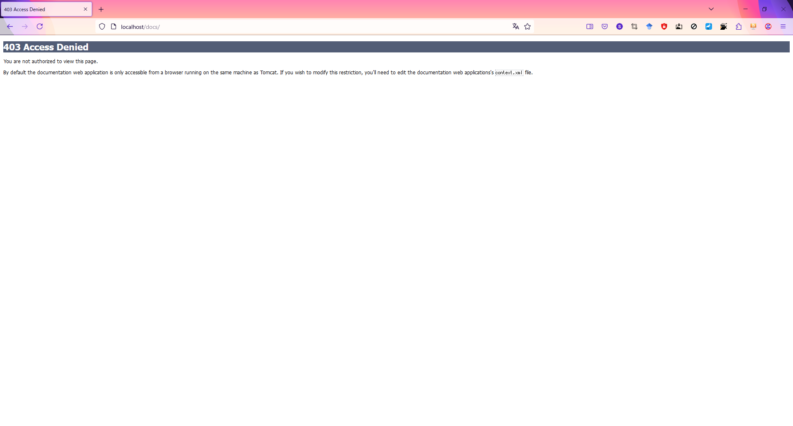
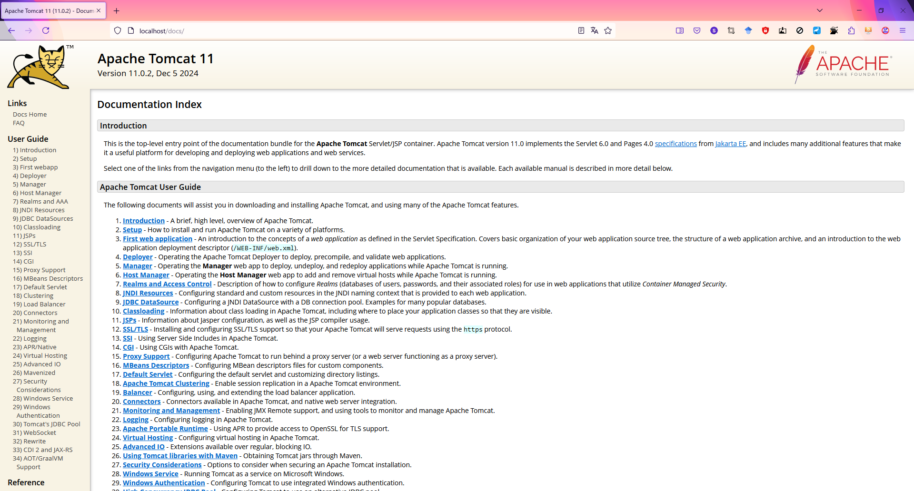
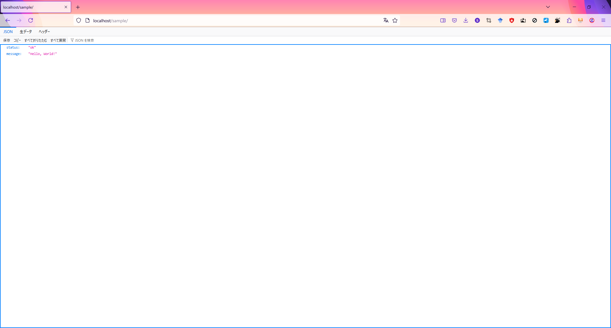

# 作業記録

## 本書の目的

本プロジェクトは、 Tomcatコンテナ + Java アプリ を用いて、最小のAPIコンテナを構成することを目的とする。

本書は、上記コンテナを構成する手順を記録する。

## VS Code のインストール

https://azure.microsoft.com/ja-jp/products/visual-studio-code

### プラグイン

Remote Development by Microsoft https://marketplace.visualstudio.com/items?itemName=ms-vscode-remote.vscode-remote-extensionpack
Github Copilot bu GitHub https://marketplace.visualstudio.com/items?itemName=GitHub.copilot

## WSLのインストール

コマンドプロンプトでWSLをインストールする。デフォルト、WSL Ubuntu がインストールされる。

```cmd
> wsl --install
> wsl -l -v
  NAME      STATE           VERSION
* Ubuntu    Running         2
```

VScodeからWSLにSSHでアタッチし、バージョンを確認。
今回は、 WSL 2 における、 Ubuntu24.04 だった。

```sh
$ lsb_release -a
No LSB modules are available.
Distributor ID: Ubuntu
Description:    Ubuntu 24.04.1 LTS
Release:        24.04
Codename:       noble
```

## Docker のインストール

Docker Engine を Ubuntu にインストール。 see. https://docs.docker.com/engine/install/ubuntu/

カレントユーザーを docker グループに登録、dockerの常時起動を設定。 https://docs.docker.com/engine/install/linux-postinstall/

## Tomcatコンテナのpullと内容確認

https://hub.docker.com/_/tomcat を見て考え...る前に、最小のDockerfileをVSCodeでさっくり作る。

```sh
$ mkdir build && cd $_
build$ touch Dockerfile
build$ cat Dockerfile
FROM tomcat:latest
```

compose.yaml を準備、とりあえず動かしてみる。

```sh
build$ touch compose.yaml
build$ cat compose.yaml
services:
  tomcat-java-api:
    image: tomcat-java-api:latest
    build:
      context: ..
      dockerfile: build/Dockerfile
build$ docker compose build
build$ docker compose up -d
```

で、入ってみたところ、それっぽくなったので、まずは成功。Dockerfileの最終行に与えたコマンドを特定しておく。

```sh
build$ docker exec -it build-tomcat-java-api-1 bash
root@db618196f52e:/usr/local/tomcat# ls
bin           conf             filtered-KEYS  LICENSE  native-jni-lib  README.md      RUNNING.txt  upstream-KEYS  webapps.dist
BUILDING.txt  CONTRIBUTING.md  lib            logs     NOTICE          RELEASE-NOTES  temp         webapps        work
root@db618196f52e:/usr/local/tomcat# exit
build$ docker inspect build-tomcat-java-api-1 | jq '.[].Config.Cmd'
[
  "catalina.sh",
  "run"
]
build$ cat Dockerfile
FROM tomcat:latest
CMD ["catalina.sh", "run"]
build$ docker compose build && docker compose up -d
```

で、Tomcatコンテナの使い方を全く知らないので調査。

```sh
build$ docker exec -it build-tomcat-java-api-1 bash
root@b3d36bcfb3c4:/usr/local/tomcat# which catalina.sh
/usr/local/tomcat/bin/catalina.sh
root@b3d36bcfb3c4:/usr/local/tomcat# catalina.sh help
Using CATALINA_BASE:   /usr/local/tomcat
Using CATALINA_HOME:   /usr/local/tomcat
Using CATALINA_TMPDIR: /usr/local/tomcat/temp
Using JRE_HOME:        /opt/java/openjdk
Using CLASSPATH:       /usr/local/tomcat/bin/bootstrap.jar:/usr/local/tomcat/bin/tomcat-juli.jar
Using CATALINA_OPTS:   
Usage: catalina.sh ( commands ... )
commands:
  debug             Start Catalina in a debugger
  jpda start        Start Catalina under JPDA debugger
  run               Start Catalina in the current window
  start             Start Catalina in a separate window
  stop              Stop Catalina, waiting up to 5 seconds for the process to end
  stop n            Stop Catalina, waiting up to n seconds for the process to end
  stop -force       Stop Catalina, wait up to 5 seconds and then use kill -KILL if still running
  stop n -force     Stop Catalina, wait up to n seconds and then use kill -KILL if still running
  configtest        Run a basic syntax check on server.xml - check exit code for result
  version           What version of tomcat are you running?
Note: Waiting for the process to end and use of the -force option require that $CATALINA_PID is defined
root@b3d36bcfb3c4:/usr/local/tomcat# find . | grep server.xml
./conf/server.xml
```

server.html のコメントに Documentation at /docs/config/server.html とか書いてあるので読みたい。
（推測）Tomcat にHTTPアクセスすれば読める？
（調査１）Tomcat にHTTPアクセスするにはどうしたら？ とりま catalina.sh のログでも読むか...

```sh
root@b3d36bcfb3c4:/usr/local/tomcat# exit
build$ docker logs build-tomcat-java-api-1
（略）
31-Jan-2025 14:35:51.798 INFO [main] org.apache.coyote.AbstractProtocol.init Initializing ProtocolHandler ["http-nio-8080"]
（略）
```

こよが、8080ポートで立ってるって言ってる気がする。

```sh
build$ docker exec -it build-tomcat-java-api-1 bash
root@b3d36bcfb3c4:/usr/local/tomcat# curl http://localhost:8080/
<!doctype html><html lang="en"><head><title>HTTP Status 404 – Not Found</title>（出力以下略）
root@b3d36bcfb3c4:/usr/local/tomcat# curl http://localhost:80/
curl: (7) Failed to connect to localhost port 80 after 0 ms: Couldn't connect to server
root@b3d36bcfb3c4:/usr/local/tomcat# exit
```

本当に立ってたので、DockerfileにExposeを、compose.yamlにportsを各々追加して再起動。

```sh
build$ cat Dockerfile
FROM tomcat:latest
Expose 8080
CMD ["catalina.sh", "run"]
build$ cat compose.yaml
services:
  tomcat-java-api:
    image: tomcat-java-api:latest
    build:
      context: ..
      dockerfile: build/Dockerfile
    ports:
      - target: 8080
        published: 80
        protocol: tcp
        mode: host
build$ docker compose build && docker compose up -d
```

上記の結果として、手元ブラウザの http://localhost/ からコンテナにアクセスできるようになった。



中身のコンテンツを何も設定できていないので４０４エラーになっているが、あたりまえ体操なので問題ない。
HTTPエラーが発生しているということは、ネットワークエラーが発生していない、すなわちHTTPサーバに正しくアクセスできているということである。

## （寄り道）Tomcatの設定方法確認

ここまでの手順にて、ブラウザからTomcatにアクセスできた。
しかし、ブラウザにアクセスしても /docs/config/server.html が読めない。
/docs ディレクトリや中身はあるが、 /webapps.dist/ が公開されていなさそう。

```sh
build$ docker exec -it build-tomcat-java-api-1 bash
root@345adeba55d1:/usr/local/tomcat# find . | grep docs
（出力は抜粋かつ行入れ替え実施）
./webapps.dist/docs/index.html
./webapps.dist/docs/cluster-howto.html
./webapps.dist/docs/jndi-resources-howto.html
./webapps.dist/docs/config/index.html
./webapps.dist/docs/config/server.html
./webapps.dist/docs/config/listeners.html
./webapps.dist/docs/config/service.html
./webapps.dist/docs/config/http.html
./webapps.dist/docs/config/ajp.html
./webapps.dist/docs/config/engine.html
./webapps.dist/docs/config/cluster.html
./webapps.dist/docs/config/valve.html
root@345adeba55d1:/usr/local/tomcat# grep -nr "webapps\.dist" || echo "NOT FOUND."
NOT FOUND.
```

上記設定を探していたが、 https://qiita.com/hidekatsu-izuno/items/ab604b6c764b5b5a86ed なるQiita記事を発見した。
一旦、こちらを読み進めてみると、

> manager は以前のバージョンではデプロイに必要になる場合もありましたが、最近のバージョンでは、webapps 以下に war ファイルを置くだけでデプロイすることができますし、追加の設定も war ファイルの META-INF/context.xml に書くことが可能なので削除しても特に困ることはありません。

とあったので、 webapps 以下でやりたいことをやれ、と読んだ。

```sh
root@345adeba55d1:/usr/local/tomcat# ls
bin  BUILDING.txt  conf  CONTRIBUTING.md  filtered-KEYS  lib  LICENSE  logs  native-jni-lib  NOTICE  README.md  RELEASE-NOTES  RUNNING.txt  temp  upstream-KEYS  webapps  webapps.dist  work
root@345adeba55d1:/usr/local/tomcat# cd webapps
root@345adeba55d1:/usr/local/tomcat/webapps# ln -sf ../webapps.dist/docs
root@345adeba55d1:/usr/local/tomcat/webapps# ls -l
total 0
lrwxrwxrwx 1 root root 20 Feb  1 01:02 docs -> ../webapps.dist/docs
```

手元ブラウザで http://localhost/docs/ にアクセスしてみる。403エラーということは404エラーではない、すなわち docs ディレクトリは認識しているということだ。



> If you wish to modify this restriction, you'll need to edit the documentation web applications's context.xml file. 

とあるので、 docs/context.xml の設定を試みるのが良さそう。

```sh
root@345adeba55d1:/usr/local/tomcat# find . | grep context.xml 
./conf/context.xml
./webapps.dist/examples/META-INF/context.xml
./webapps.dist/host-manager/META-INF/context.xml
./webapps.dist/docs/META-INF/context.xml
./webapps.dist/manager/META-INF/context.xml
root@345adeba55d1:/usr/local/tomcat# cd webapps.dist/docs/META-INF/
root@345adeba55d1:/usr/local/tomcat# cat context.xml
（抜粋）
<Context antiResourceLocking="false" ignoreAnnotations="true">
  <Valve className="org.apache.catalina.valves.RemoteAddrValve"
         allow="127\.\d+\.\d+\.\d+|::1|0:0:0:0:0:0:0:1" />
</Context>
```

確かに、 IPアドレスとして、127.x.x.x、::1、0:0:0:0:0:0:0:1、つまりローカルホストしか記載していない。エラーページの、

> By default the documentation web application is only accessible from a browser running on the same machine as Tomcat.

の記載に一致する。さらに寄り道して、コンテナ内、WSL内のどちらが「the same machine as Tomcat」かを抑えておく。

```sh
root@345adeba55d1:/usr/local/tomcat# curl http://localhost:8080/docs/
（ページが表示された。内容略）
root@345adeba55d1:/usr/local/tomcat# exit
build$ curl http://localhost/docs/
（４０３エラーページが表示された。内容略）
```

というわけで、「the same machine as Tomcat」はコンテナ内のみであった。
tomcatコンテナにはviもnanoも入っていないようなので、大人しくDockerfileから書き換える。

```sh
build$ mkdir ../tomcat_docs && pushd $_
tomcat_docs$ cat context.xml
（抜粋）
<Context antiResourceLocking="false" ignoreAnnotations="true">
  <!--
  <Valve className="org.apache.catalina.valves.RemoteAddrValve"
         allow="127\.\d+\.\d+\.\d+|::1|0:0:0:0:0:0:0:1" />
  -->
</Context>
tomcat_docs$ popd
build$ cat Dockerfile
（抜粋）
COPY ../tomcat_docs/context.xml    /usr/local/tomcat/webapps.dist/docs/META-INF/
RUN ln -sf /usr/local/tomcat/webapps.dist/docs /usr/local/tomcat/webapps/docs
build$ docker compose build && docker compose up -d
```

こうして、無事 http://localhost/docs/ にアクセスできました。



あれ、これって https://tomcat.apache.org/tomcat-11.0-doc/ と全く同じでは...？ ちくしょう、おあとがよろしいようで。

## （確認）APIアプリの作成方針の確認

上記寄り道は、サンプルアプリの docs ディレクトリについて、手で考察した作業記録としての効果があった。
下記はtomcatが用意したサンプルアプリと思われるが、全て META-INF ディレクトリと WEB_INF ディレクトリを持っていた。

```sh
root@603e55c118ce:/usr/local/tomcat/webapps.dist# ls
docs  examples  host-manager  manager  ROOT
```

つまり、最小APIのJavaプロジェクトは、単にWARファイルを作れば良い、ということになる。完成形は定まった（というか、個人的にようやく理解した）。

```sh
root@603e55c118ce:/usr/local/tomcat/webapps.dist# exit
build$ docker compose down
```

## APIアプリの作成（１）テンプレートの作成

https://qiita.com/lz910201/items/ee5546a614ed3ccaaa23 によれば、[Spring Initializr](https://start.spring.io/)なるWebツールで初期ディレクトリを構築するらしい。

Spring Initializr のページはこっそり Kotlin を推しているようなの画面レイアウトに見えた。
この機会に Kotlin にも触れてみよう（とやると悪いハマり方するのだが、まあそれも経験ということで）。

キーワード Kotlin + Spring Boot で検索、準公式っぽいサイトに当たったので、 https://spring.pleiades.io/guides/tutorials/spring-boot-kotlin をもとに、以下のとおり設定する。

* Project : Gradle - Kotlin
* Language : Kotlin
* Spring Boot : 3.4.2 （これより新しいのはstableじゃないっぽい...）
* Project Metadata
  * Group はデフォルトそのまま。
  * Artifact : sample とする。設定時、 Name, Package Name が追従して変更された。
  * Descripton : Sample Project
  * Packaging : War。Tomcatを使うのでこちら。
  * Java : 21。理由は後述。
* Dependencies は以下を選択。
  * Spring Web

javaバージョンを21とした理由は、 tomcat:latest コンテナに合わせたため。
```sh
root@603e55c118ce:/usr/local/tomcat# java --version
openjdk 21.0.6 2025-01-21 LTS
OpenJDK Runtime Environment Temurin-21.0.6+7 (build 21.0.6+7-LTS)
OpenJDK 64-Bit Server VM Temurin-21.0.6+7 (build 21.0.6+7-LTS, mixed mode, sharing)
root@603e55c118ce:/usr/local/tomcat# javac --version
javac 21.0.6
```
念のため、この時点でコンテナのバージョンを確定させておく。
https://hub.docker.com/_/tomcat によれば、本日時点で tomcat:latest は 11.0.2-jdk21-temurin-noble であった。

```sh
build$ cat Dockerfile
（抜粋）
FROM tomcat:11.0.2-jdk21-temurin-noble
build$ docker compose build && docker compose up -d
```

生成した sample.zip はそのまま展開する。展開前のファイルも含め、本リポジトリに登録。

```sh
$ sudo apt install unzip
$ unzip sample.zip
$ git add .
```

## APIアプリの作成（２）ローカル WSL に Java 環境を構築

devContainer ならともかく、 tomcat コンテナでのjavaアプリビルドは無理があるので、
ホストWSLにもJavaを入れておく。

```sh
$ sudo apt install openjdk-21-jdk
$ java --version
openjdk 21.0.5 2024-10-15
OpenJDK Runtime Environment (build 21.0.5+11-Ubuntu-1ubuntu124.04)
OpenJDK 64-Bit Server VM (build 21.0.5+11-Ubuntu-1ubuntu124.04, mixed mode, sharing)
$ javac --version
javac 21.0.5
```

パッチバージョンは異なるが、よさげなので進める。

## APIアプリの作成（３）コントローラーのコーディング

API応答するコードを作っていく。今回は SampleController.kt とする。
前述のページはHTMLファイルを返す感じだったので、以下のページに乗り換える。
https://tatsurotech.hatenablog.com/entry/springboot/rest-api-basic
https://spring.pleiades.io/guides/gs/rest-service

```sh
$ pushd sample/src/main/kotlin/com/example/sample/
sample/src/main/kotlin/com/example/sample$ touch SampleController.kt
sample/src/main/kotlin/com/example/sample$ cat SampleController.kt
package com.example.sample

// springframework の annotation を import する
import org.springframework.web.bind.annotation.GetMapping
import org.springframework.web.bind.annotation.RestController

data class SampleResponse(
        val status: String,
        val message: String
)

@RestController
public class SampleController {
        @GetMapping("/")
        fun hello() = SampleResponse("ok", "Hello, World!")
}
sample/src/main/kotlin/com/example/sample$ popd
```

データクラスとコントローラークラスのファイルが１つになっており言語設計方針には反していそうだが、
個人的に好きなのでこのまま進める。
SampleController.kt を作成できたら、ビルド＆実行してみる。

```sh
$ cd sample
sample$ ./gradlew build
OpenJDK 64-Bit Server VM warning: Sharing is only supported for boot loader classes because bootstrap classpath has been appended

BUILD SUCCESSFUL in 8s
8 actionable tasks: 7 executed, 1 up-to-date
sample$ ./gradlew bootRun
（抜粋）
2025-02-01T12:05:36.094+09:00  INFO 54491 --- [sample] [           main] o.s.b.w.embedded.tomcat.TomcatWebServer  : Tomcat started on port 8080 (http) with context path '/'
```
上記 terminal は実行中になるので、別のterminalを立ち上げ、動作確認を行う。
```sh
$ curl http://localhost:8080/
{"status":"ok","message":"Hello, World!"}
```
うまく行ったらしい。

## APIアプリの作成（４）WARファイルの作成、実行、内容確認

tomcatに組み込むにあたっては、展開済みWARファイルを /usr/local/tomcat/webapps/ 配下にコピーしたい。
このため、いったんはビルドシステム上でWARファイルを作る。

```sh
sample$ ./gradlew bootWar
sample$ find . -type f | grep war
./build/libs/sample-0.0.1-SNAPSHOT-plain.war
./build/libs/sample-0.0.1-SNAPSHOT.war
./build/tmp/war/MANIFEST.MF
sample$ java -jar build/libs/sample-0.0.1-SNAPSHOT.war 
（抜粋）
2025-02-01T12:30:30.412+09:00  INFO 62091 --- [sample] [           main] o.s.b.w.embedded.tomcat.TomcatWebServer  : Tomcat started on port 8080 (http) with context path '/'
```
上記も terminal は実行中になるので、別のterminalを立ち上げ、動作確認を行う。
```sh
$ curl http://localhost:8080/
{"status":"ok","message":"Hello, World!"}
```
うまく行ったので分析に入る。
```sh
sample$ jar tf build/libs/sample-0.0.1-SNAPSHOT-plain.war | grep -v "/$"
META-INF/MANIFEST.MF
WEB-INF/classes/META-INF/sample.kotlin_module
WEB-INF/classes/com/example/sample/SampleController.class
WEB-INF/classes/com/example/sample/SampleResponse.class
WEB-INF/classes/com/example/sample/SampleApplication.class
WEB-INF/classes/com/example/sample/ServletInitializer.class
WEB-INF/classes/com/example/sample/SampleApplicationKt.class
WEB-INF/classes/application.properties
WEB-INF/lib/spring-boot-starter-web-3.4.2.jar
WEB-INF/lib/spring-boot-starter-json-3.4.2.jar
WEB-INF/lib/jackson-datatype-jdk8-2.18.2.jar
WEB-INF/lib/jackson-datatype-jsr310-2.18.2.jar
WEB-INF/lib/jackson-module-parameter-names-2.18.2.jar
WEB-INF/lib/jackson-databind-2.18.2.jar
WEB-INF/lib/jackson-annotations-2.18.2.jar
WEB-INF/lib/jackson-core-2.18.2.jar
WEB-INF/lib/jackson-module-kotlin-2.18.2.jar
WEB-INF/lib/kotlin-reflect-1.9.25.jar
WEB-INF/lib/kotlin-stdlib-1.9.25.jar
WEB-INF/lib/annotations-13.0.jar
WEB-INF/lib/spring-boot-starter-3.4.2.jar
WEB-INF/lib/spring-webmvc-6.2.2.jar
WEB-INF/lib/spring-web-6.2.2.jar
WEB-INF/lib/spring-boot-autoconfigure-3.4.2.jar
WEB-INF/lib/spring-boot-3.4.2.jar
WEB-INF/lib/spring-boot-starter-logging-3.4.2.jar
WEB-INF/lib/spring-context-6.2.2.jar
WEB-INF/lib/spring-aop-6.2.2.jar
WEB-INF/lib/spring-beans-6.2.2.jar
WEB-INF/lib/spring-expression-6.2.2.jar
WEB-INF/lib/spring-core-6.2.2.jar
WEB-INF/lib/snakeyaml-2.3.jar
WEB-INF/lib/micrometer-observation-1.14.3.jar
WEB-INF/lib/logback-classic-1.5.16.jar
WEB-INF/lib/log4j-to-slf4j-2.24.3.jar
WEB-INF/lib/jul-to-slf4j-2.0.16.jar
WEB-INF/lib/spring-jcl-6.2.2.jar
WEB-INF/lib/micrometer-commons-1.14.3.jar
WEB-INF/lib/logback-core-1.5.16.jar
WEB-INF/lib/slf4j-api-2.0.16.jar
WEB-INF/lib/log4j-api-2.24.3.jar
```
なお、別途 sample-0.0.1-SNAPSHOT-plain.war と sample-0.0.1-SNAPSHOT-plain.war に含まれているファイルを比較したところ、結果は以下の通りだった。
* sample-0.0.1-SNAPSHOT-plain.war のみにあるのは以下。
  * WEB-INF/lib/spring-boot-starter-web-3.4.2.jar
  * WEB-INF/lib/spring-boot-starter-json-3.4.2.jar
  * WEB-INF/lib/spring-boot-starter-3.4.2.jar
  * WEB-INF/lib/spring-boot-starter-logging-3.4.2.jar
* sample-0.0.1-SNAPSHOT.war のみにあるのは以下。
  * META-INF/services/java.nio.file.spi.FileSystemProvider
  * org/springframework/boot/loader/ 以下の多数のクラスファイル
  * WEB-INF/lib-provided/spring-boot-starter-tomcat-3.4.2.jar
  * WEB-INF/lib-provided/jakarta.annotation-api-2.1.1.jar
  * WEB-INF/lib-provided/tomcat-embed-websocket-10.1.34.jar
  * WEB-INF/lib-provided/tomcat-embed-core-10.1.34.jar
  * WEB-INF/lib-provided/tomcat-embed-el-10.1.34.jar
  * WEB-INF/lib/spring-boot-jarmode-tools-3.4.2.jar
  * WEB-INF/classpath.idx
  * WEB-INF/layers.idx

## APIアプリの作成（４）Tomcatへの上記アプリ組み込み

tomcatサンプルのMETA-INF と WEB-INFについては、最低限 sample-0.0.1-SNAPSHOT-plain.war に含まれていそうだった。
これを build ディレクトリに取り込んで、ファイル名をAPIのURLに変更する。

```sh
sample$ cp build/libs/sample-0.0.1-SNAPSHOT-plain.war ../build/
build$ cat Dockerfile
（抜粋）
ADD build/sample-0.0.1-SNAPSHOT-plain.war /usr/local/tomcat/webapps/sample.war
build$ docker compose build && docker compose up -d
```
コンテナ内外で動作確認。
```sh
$ docker exec -it build-tomcat-java-api-1 bash
root@d73cce6df55d:/usr/local/tomcat# curl http://localhost:8080/sample/
{"status":"ok","message":"Hello, World!"}
$ curl http://localhost/sample/
{"status":"ok","message":"Hello, World!"}
```
Windows（ブラウザ）からの確認も以下の通りOK。


ちなみに、コンテナの中身は以下のとおり。
> webapps 以下に war ファイルを置くだけでデプロイすることができます
との記載が正しいことを確認できた。
```sh
$ docker exec -it build-tomcat-java-api-1 bash
root@d73cce6df55d:/usr/local/tomcat# cd webapps
root@d73cce6df55d:/usr/local/tomcat/webapps# ls -l
total 18720
lrwxrwxrwx 1 root root       35 Feb  1 01:38 docs -> /usr/local/tomcat/webapps.dist/docs
drwxr-x--- 4 root root     4096 Feb  1 03:52 sample
-rw-r--r-- 1 root root 19163123 Feb  1 03:47 sample.war
root@d73cce6df55d:/usr/local/tomcat/webapps# find sample -type f
sample/WEB-INF/lib/spring-boot-starter-logging-3.4.2.jar
sample/WEB-INF/lib/jackson-module-kotlin-2.18.2.jar
sample/WEB-INF/lib/spring-beans-6.2.2.jar
sample/WEB-INF/lib/jackson-datatype-jdk8-2.18.2.jar
sample/WEB-INF/lib/spring-aop-6.2.2.jar
sample/WEB-INF/lib/log4j-api-2.24.3.jar
sample/WEB-INF/lib/annotations-13.0.jar
sample/WEB-INF/lib/jackson-datatype-jsr310-2.18.2.jar
sample/WEB-INF/lib/spring-jcl-6.2.2.jar
sample/WEB-INF/lib/spring-webmvc-6.2.2.jar
sample/WEB-INF/lib/micrometer-observation-1.14.3.jar
sample/WEB-INF/lib/micrometer-commons-1.14.3.jar
sample/WEB-INF/lib/jackson-module-parameter-names-2.18.2.jar
sample/WEB-INF/lib/logback-core-1.5.16.jar
sample/WEB-INF/lib/spring-boot-starter-json-3.4.2.jar
sample/WEB-INF/lib/spring-context-6.2.2.jar
sample/WEB-INF/lib/jackson-core-2.18.2.jar
sample/WEB-INF/lib/jackson-databind-2.18.2.jar
sample/WEB-INF/lib/jackson-annotations-2.18.2.jar
sample/WEB-INF/lib/spring-boot-starter-web-3.4.2.jar
sample/WEB-INF/lib/logback-classic-1.5.16.jar
sample/WEB-INF/lib/jul-to-slf4j-2.0.16.jar
sample/WEB-INF/lib/spring-web-6.2.2.jar
sample/WEB-INF/lib/snakeyaml-2.3.jar
sample/WEB-INF/lib/spring-core-6.2.2.jar
sample/WEB-INF/lib/log4j-to-slf4j-2.24.3.jar
sample/WEB-INF/lib/spring-expression-6.2.2.jar
sample/WEB-INF/lib/slf4j-api-2.0.16.jar
sample/WEB-INF/lib/spring-boot-starter-3.4.2.jar
sample/WEB-INF/lib/spring-boot-3.4.2.jar
sample/WEB-INF/lib/kotlin-reflect-1.9.25.jar
sample/WEB-INF/lib/spring-boot-autoconfigure-3.4.2.jar
sample/WEB-INF/lib/kotlin-stdlib-1.9.25.jar
sample/WEB-INF/classes/META-INF/sample.kotlin_module
sample/WEB-INF/classes/application.properties
sample/WEB-INF/classes/com/example/sample/SampleController.class
sample/WEB-INF/classes/com/example/sample/SampleResponse.class
sample/WEB-INF/classes/com/example/sample/SampleApplication.class
sample/WEB-INF/classes/com/example/sample/ServletInitializer.class
sample/WEB-INF/classes/com/example/sample/SampleApplicationKt.class
sample/META-INF/MANIFEST.MF
sample/META-INF/war-tracker
```

## 作業を完走した感想その他

普段、WebアプリはJavascriptで作っているが、今回Java（Kotlin）で初めて作ってみた記録となる。
JavaでWebアプリを作る際の annotation についてどうしても理解できなかったところ、 import 分の失念によるエラーで理解が出来たところが個人的に大きい。

当然、本プロジェクトの内容をそのまま使えるわけではない。
sample-0.0.1-SNAPSHOT-plain.war の取り回しは業務運用を想定すると論外であり、CI/CDのアーティファクト等で処理すべきところではある。
が、 Spring Initializr のところといい、リポジトリからでは見えない手順ノウハウとして残せたことは、本プロジェクトとしてはより大きな成果を得られたものと思っている。
